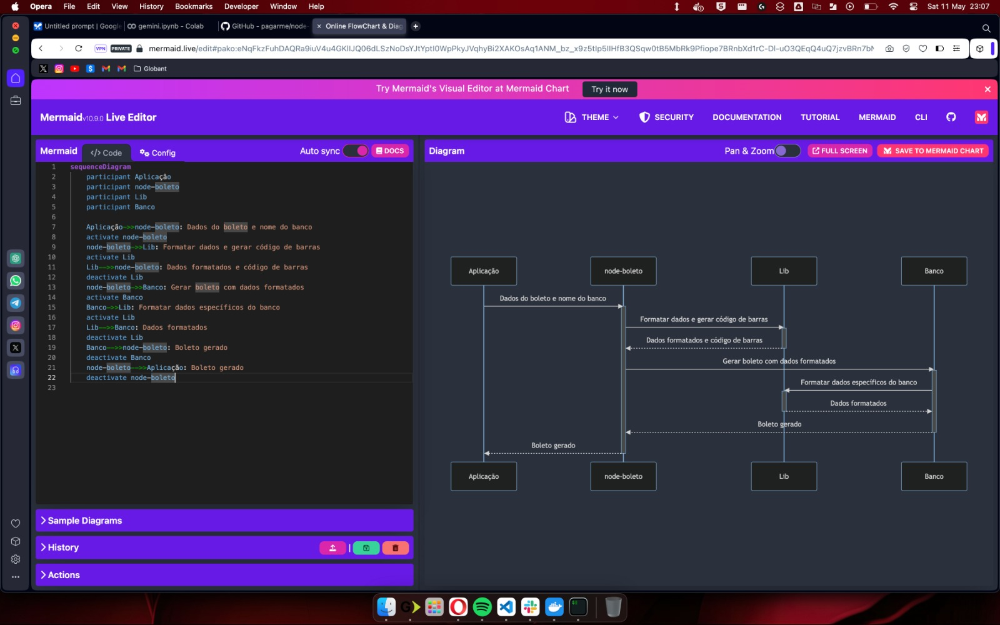

# Ask To Code
Extraindo Conhecimento direto do código com Inteligência Artificial

## Objetivo

O Ask To Code é um projeto inovador que utiliza inteligência artificial GEMINI para extrair informações importantes de repositórios através de uma interface de chat amigável.

## Público-alvo

O Ask To Code foi desenvolvido para atender às necessidades de:

- **Desenvolvedores:** O Ask To Code permite que os desenvolvedores obtenham rapidamente insights valiosos sobre seus repositórios. Isso pode economizar tempo e esforço, permitindo que os desenvolvedores se concentrem em tarefas mais importantes.
  
- **Pessoas não técnicas:** O Ask To Code torna a análise de código acessível a pessoas sem experiência em programação. Isso pode ser útil para gerentes de projeto, analistas de negócios e outras partes interessadas que precisam entender o funcionamento de sistemas.

## Funcionalidades

O Ask To Code oferece uma variedade de funcionalidades, incluindo:

- **Suprir carência de documentação na maioria dos projetos.

- **Extração de regras de negócios:** O Ask To Code pode identificar e extrair automaticamente regras de negócios do código fonte. 
  
- **Geração de diagramas:** O Ask To Code pode gerar automaticamente diagramas a partir do código fonte. Isso pode ajudar a visualizar o fluxo de dados e a estrutura do código, facilitando sua compreensão.
  
- **Resposta a perguntas em linguagem natural:** O Ask To Code pode responder a perguntas sobre o código fonte em linguagem natural. Isso permite que os usuários obtenham informações sobre o código sem a necessidade de escrever consultas complexas.

## Benefícios

O Ask To Code oferece vários benefícios, incluindo:

- **Melhora na produtividade:** O Ask To Code pode economizar tempo e esforço para desenvolvedores e pessoas não técnicas, permitindo que eles obtenham informações sobre repositórios Git de forma rápida e fácil.
  
- **Melhor comunicação:** O Ask To Code pode ajudar a melhorar a comunicação entre desenvolvedores e pessoas não técnicas, fornecendo uma maneira fácil de compartilhar informações sobre código fonte.
  
- **Maior compreensão do código:** O Ask To Code pode ajudar os usuários a entender melhor o código fonte, fornecendo insights valiosos sobre regras de negócios, fluxos de dados e estrutura do código.

